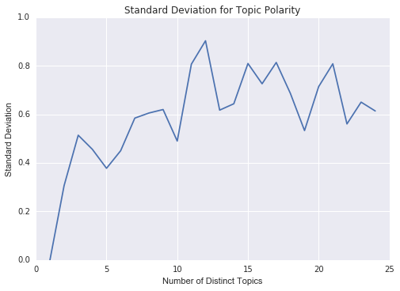

#Project Fletcher    

##Background    
For this project, the goal was to do some data exploration on text data using an unsupervised algorithm. 
Initially, I sought to do a much more comprehensive project exploring the condition called [hypergraphia] (https://en.wikipedia.org/wiki/Hypergraphia), said to afflict many famous writers. 
The disorder is characterized by an obsessive urge to write. I wanted to compare the writing styles of alleged hypergraphic authors to those contemporaries of the same genre.
However, I realized that far more clinical knowledge would have been necessary to understand in which direction to go.
So, instead, I decided to investigate the works of one particular writer rumored to be afflicted with hypergraphia, Edgar Allen Poe.
Since Poe is known to have widely variable [themes] (https://en.wikipedia.org/wiki/Edgar_Allan_Poe#Literary_style_and_themes) in his writings, I wanted to see if there was some way to capture them.    

##Process    
I culled 66 short stories written by Poe, which is available at Project Gutenberg. I chose to limit it to short stories for consistency in the type of documents modeled on.
I used removed stop-words and used SKlearn's count vectorizer to change each story into a count vector. Next, I tried to use LDA topic modeling to find distinct topics.
There's an interesting design question inherent in topic modeling: how many topics to model on? Generally, the answer is subjective, choosing however many produce what appear to be meaningful distinct topics.
I wanted to try to find some method to try to "capture" the right number more objectively.    

So, I had the following intuition: I'd assume that an individual topic will contain a generally consistent emotive tone, calculated by TextBlob's sentiment analysis.
However, different topics will generally differ from one another in emotive tone. If I were to assume too few topics, when weighing the polarity of the most common words per topic, they would not vary too much since each topic would contain so many varied words. 
On the other hand, if I chose too many topics, each one would be cut down to too few words to capture any significant emotive tone. So, there must be some "middle ground" where there are enough topics to capture varied sentiments yet not too many to "water down" each one.
Optimizing for standard deviation, I found this to indeed be true 
