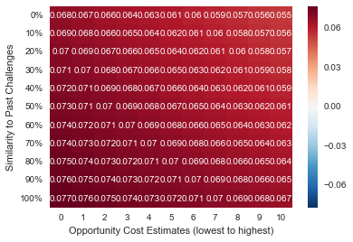

# Project Kojak- Updated (2017)

With another season of MLB data (2017) and some additional time to revise my methodology, I revised my [MLB Replay Challenge model.](MLBChallengesOct26.ipynb)

The first change I made was the classification model I decided to use. Initially I turned all of my features (which are categorical) into numbers that reflect percentage of time that a call was overturned with that feature (to avoid a massive amount of dummy variables and to find a way to capture the nuance between calls that were “confirmed” vs. those that were “upheld”). However, I realized that this was a mistake for a few reasons. First, by incorporating the whole dataset in creating these feature result averages, I leaked test data into the training set. Furthermore, I had a hard time figuring out a way that the nuance between an “upheld” call vs. a “confirmed” call could provide any sort of signal. After all, the final outcome is always equivalent. So, instead I dropped the upheld/confirmed distinction and used a specialized algorithm, cat boost, that is designed to work well on categorical features. The cross-validation log-loss metrics were pretty close to my previous models (despite them being inflated by leaked data).

Additionally, I created an function that returns a heat map that would show a sort of confidence interval as to the overall gain from challenging a call. I did this across two inputs: 
1) the “opportunity cost” of a lost challenge ranging from the most cautious estimate (purely based on points below .500 for a resulting lost challenge per out remaining) to my regular estimate, which I had initially used (though still very low) and 
2) A range from 0-100% of how “similar” a challenge is to past attempted challenges for a team.

Below is an example of a possible heat map:

Since almost the whole region is closer to red than blue, that means that the manager should challenge under the entire range of model assumptions.
